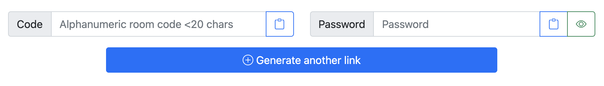
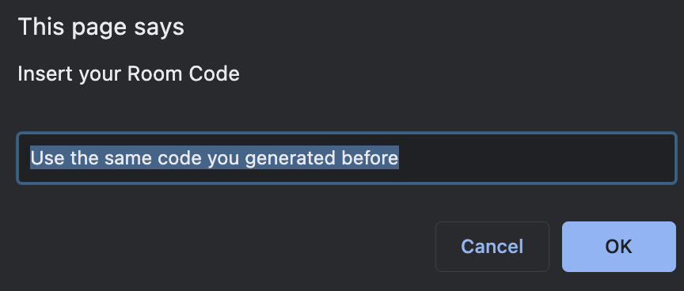
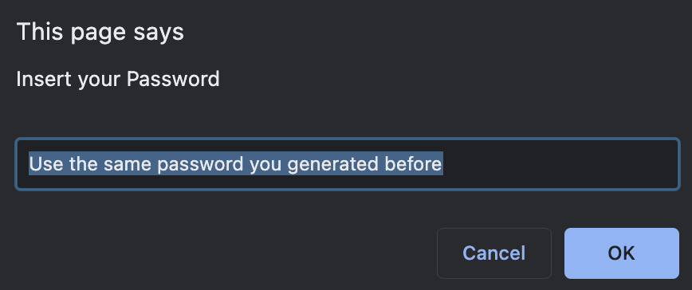

# DemoKit for team presentations
A way to share your screen and camera on the same window, making your presentations more professional and beautiful.

## Content
1. [👀 The different views](#the-different-views)
1. [🧱 Set up a room](#set-up-a-room)
1. [📜 License](#license)
1. [💻 OBS Ninja](#obs-ninja)

## The different views
The demokit is comprised of 3 pages that represent 3 different modes.
| Page | Description | File |
| - | - | - |
| Invitation | Create and manage new invitation links. Generates 1 presenter at the time. | `invite.html` |
| Producer | You can pre-view all presenters at the same time. Generate 3 presenter pre-views at a time | `producer.html` |
| Sharing | The window to share your presentation. You can move presenters by using your `numpad`, numbers from 1 - 9 | `index.html` |

## Set up the room
The first time you open a page you are presented with an input request. This request changes depending on the page you open.
- For __Producer View__ and __Invite View__

- For __Sharing View__

| Code | Password |
| - | - |
|  |  |

> __Note:__ Make sure you always use the same __CODE__ and __PASSWORD__ between the different views.

## License
The source code for this project is released under the [MIT License](https://mit-license.org/).

## OBS Ninja
This demokit leverages the [obs.ninja](https://obs.ninja/) software create by [Steve Seguin](https://github.com/steveseguin). You can view the code in [GitHub](https://github.com/steveseguin/obsninja).